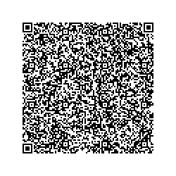
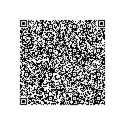
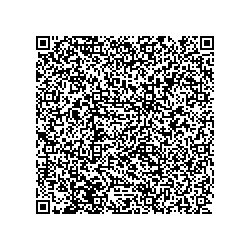
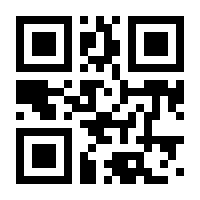

# Vaccinationsbevis verifiering

Xamarin Application for verifying EU Digital Covid Certificate based on
 specific business rules for a specific use case.

---

## About Vaccinationsbevis verifiering

This GitHub-repository contains a reference implementation for the validation
of the EU Digital Covid Certificate, with the purpose of verifying vaccination
events in regards to specific business rules for a specific use case.

The solution is developed by Swedish Agency for Digital Government (DIGG).

## Components

* [VaccinbevisVerifiering] - The Common Xamarin code.

* [VaccinbevisVerifiering.Android] - Android specific code.

* [VaccinbevisVerifiering.iOS] - iOS Specific code.

## Resources

### DCC Trust Point
Vaccinationsbevis Verifiering downloads, and caches resources that are used during the verification process.
The application downloads its resources once every 24 hours, when internet connectivity is available.
In the event that no internet connectivity is available or that the resources can't be downloaded, then
the cached version of the resources are used until they can be downloaded and cached once again.

The application uses the Swedish DCC Trust Point to download its external resources 
* QA-environment https://dgcg-qa.covidbevis.se/tp/
* Production-environment https://dgcg.covidbevis.se/tp/

There are two resources that the application needs to perform the verification:
* __Trust List__ - A list of all valid Signature public keys
* __Value Sets__ - Multiple value sets each with a defined set of values. E.g. _vaccines-covid-19-names_ 

The resources available at the Swedish DCC Trust Point have their origin in the EU Digital Covid Certificate Gateway (EU DCCG),
as shown in the following illustration:

More information about the Swedish DCC Trust Point can be found at [DCC-trust](https://github.com/DIGGSweden/dgc-trust)

### Specific Business rules
Vaccinationsbevis Verifiering can download the currently active business rules for the applications
specific use case.

## Test data

The following certificates can be used in the QA-environment.

| Test case | Description | QR-code | Expected result |
| ------------- | ------------- | :-------------: | :---------------: |
| Fully vaccinated, quarantine period passed | Valid: 2023-07-01 Vaccine: Comirnaty (EU/1/20/1528) Dose: 2/2 Signature:Valid  |   | ✔ |
| Fully vaccinated, quarantine period passed | Valid: 2023-07-01 Vaccine: Janssen (EU/1/20/1525) Dose: 1/1 Signature:Valid  |  | ✔ |
| Booster dose within quarantine period | Vaccine: Comirnaty (EU/1/20/1528) Dose: 3/3 Vaccination Date: <14 days ago Signature:Valid  | Create from https://dgc.a-sit.at/ehn/  | ✔ |
| Booster dose within quarantine period | Vaccine: Janssen (EU/1/20/1525) Dose: 2/2 Vaccination Date: <14 days ago Signature:Valid  | Create from https://dgc.a-sit.at/ehn/  | ✔ |
| Expired |  |  | ❌ |
| Invalid signature |  |  | ❌ |
| Invalid DCC type | Type: Recovered |  | ❌ |
| Invalid DCC type | Type: Tested |  | ❌ |
| Not a DCC QR-code | Link to https://digg.se |  | ❌ |
| Invalid vaccine | Valid: 2023-07-01 Vaccine: BBIBP-CorV (BBIBP-CorV) Dose: 2/2 Signature: Valid |  | ❌ |
| To few doses | Valid: 2023-07-01 Vaccine: Comirnaty (EU/1/20/1528) Dose: 1/2 Signature:Valid |  | ❌ |
| Fully vaccinated within quarantine period | Vaccine: Comirnaty (EU/1/20/1528) Dose: 2/2 Vaccination Date: <14 days ago Signature:Valid | Create from https://dgc.a-sit.at/ehn/ | ❌ |
| Fully vaccinated within quarantine period | Vaccine: Janssen (EU/1/20/1525) Dose: 1/1 Vaccination Date: <14 days ago Signature:Valid | Create from https://dgc.a-sit.at/ehn/ | ❌ |

------

Copyright &copy; 2021, [Myndigheten för digital förvaltning (DIGG)](http://www.digg.se). Licensed under the MIT license.
